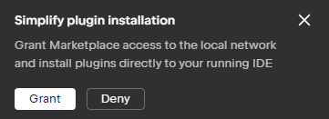
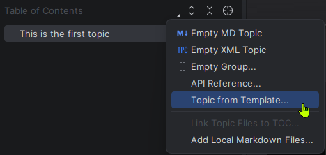
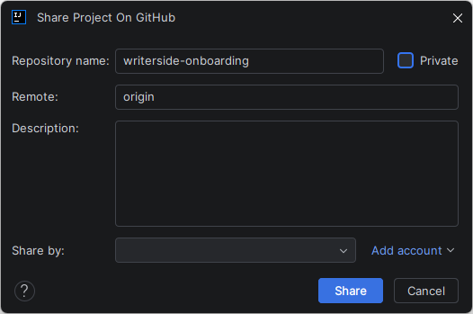

# Set up Writerside Environment

This guide helps new technical writers at JetBrains set up their local development environment, create their first documentation project, and publish it to a remote repository.

## Prerequisites

- **IntelliJ IDEA:** Ensure the latest version is installed and running.
- **GitHub Account:** Ensure you have an active account and Git is configured locally.
<note>
    
If you perform a fresh Git installation, set your username and email:

    <code-block lang="bash">
git config --global user.name "your name"
git config --global user.email "your.email@example.com"
    </code-block>
</note>

## Install the Writerside plugin

1.	Navigate to the Writerside plugin page. 
If shown the following pop-up, click **Grant**.
{style="block"}
(After clicking **Grant**, the **Get** button label changes to **Install to IntelliJ IDEA**.)
2.	Click **Install to IntelliJ IDEA** to start the installation.
<note>
<b>macOS:</b> Safari does not support automatic detection of installed JetBrains IDEs. If you click <b>Get</b> and see a list of downloadable files, install the plugin instead via <b>Settings | Plugins</b> within IntelliJ IDEA.
</note>
3.	In the **Choose Plugins to Install or Enable** dialog that opens in IntelliJ IDEA, click **OK**.
4.	Restart IntelliJ IDEA to complete the installation.

## Create a documentation project
1.	From the main menu, select **File | New | Project**.
2.	Select **Writerside** from the left-hand list.
3.	Choose **Starter Project** and click **Next**.
4.	Specify the name and location for your new project and click **Create**.

## Add your onboarding content
1.	In the **Table of Contents** tool window, click the **+** (Add) button.
2.	Select **Topic from Template...** and choose **Tutorial**.
{style="block"}
3.	In the **Title** field, enter Onboarding: Setting up your Writerside Environment.
<note>
Writerside will automatically suggest a filename; you can keep the default or simplify it (for example, onboarding-writerside-setup.md).
</note>
4.	Click **OK** to create the topic.
5.	Document the exact steps you took to complete this assignment within the new topic.
<note>
Treat this as a real-world guide for a new writer joining the team. Ensure the information is logically structured and easy to follow.
</note>
<tip>
Refer to the 
<a href="https://www.jetbrains.com/help/writerside/discover-writerside.html">Writerside documentation</a> for syntax and formatting guidance.
</tip>

## Build and verify documentation

Perform a local build to ensure the project is free of errors and warnings.
1.	In the **Writerside** tool window, select your help instance, click **Export To**, and select **Web Archive**.
2.	In the **Edit Configuration Settings** dialog, leave the default settings and click **Run**.
3.	After the build completes, review the log in the **Run** tab. Ensure it concludes with a message stating the instance built without problems.

## Push the source code to GitHub
Set up a GitHub repo and push the source code to it.
1.	From the main menu, select **VCS | Share Project on GitHub**.
2.  In the **Share Project On GitHub** dialog, configure the following:
    {style="block"}

    **Repository name:** Keep the default writerside-onboarding  
    **Private:** Ensure this checkbox is cleared to keep the repository public.  
    **Remote:** Leave this as `origin`.  
   **Share by:** Select your GitHub account.  
    (If no account is listed, click **Add account** and select **Log In via GitHub** to authorize the IDE in your browser.)
3.	Click **Share**.
4.	In the **Add Files for Initial Commit** dialog, select all files, enter a commit message (e.g., `Initial commit`), and click **Add**.
5.	Wait for the "Successfully shared project on GitHub" notification to appear.
<note>
In GitHub, check that the repo is indeed public because sometimes GitHub overrides the <b>Private</b> checkbox setting when the repo is created (consult the <a href="https://docs.github.com/en/apps/creating-github-apps/registering-a-github-app/making-a-github-app-public-or-private">GitHub documentation</a> if you are not sure how to do this).
</note>
